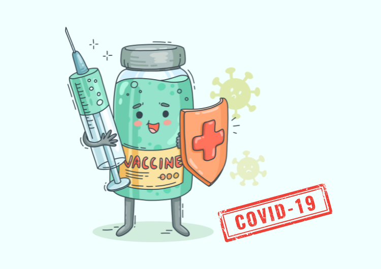
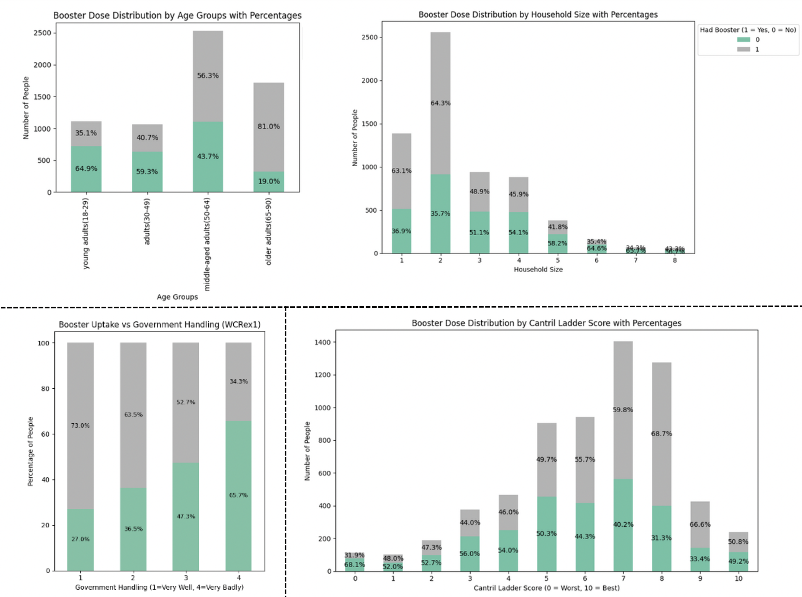
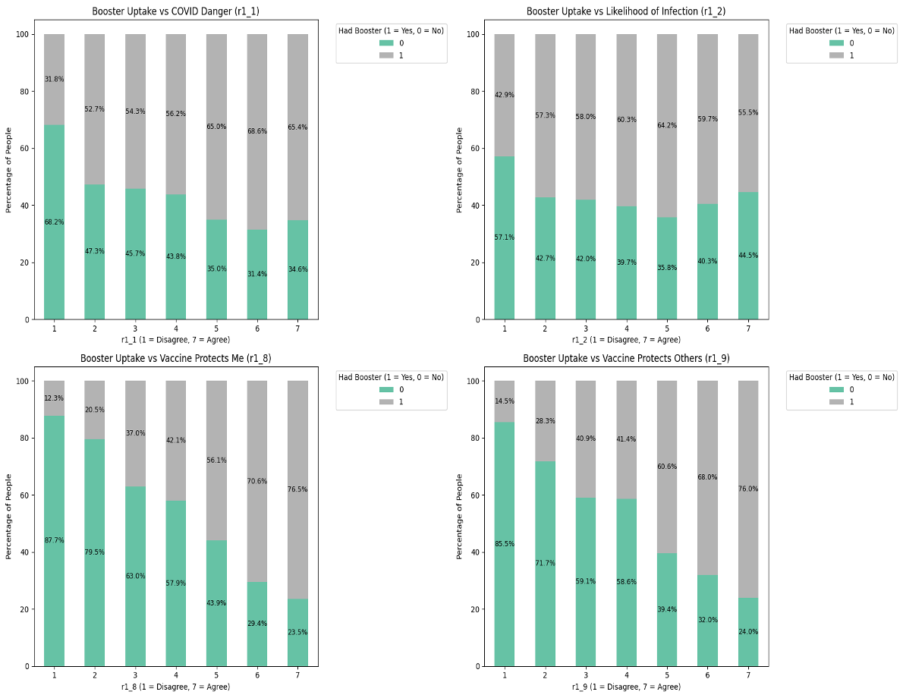
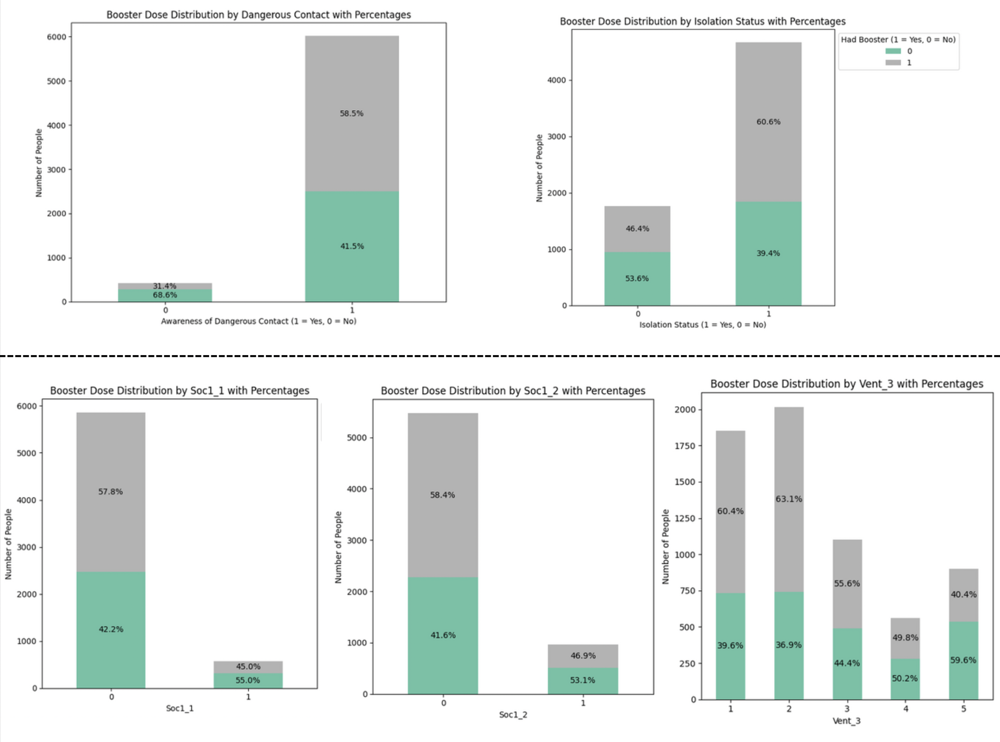
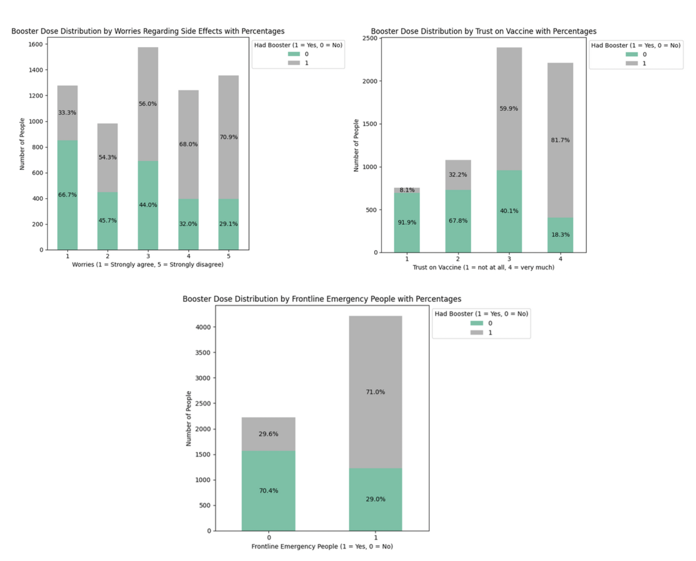
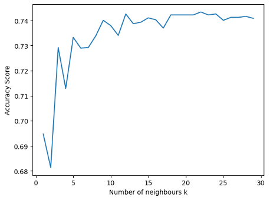
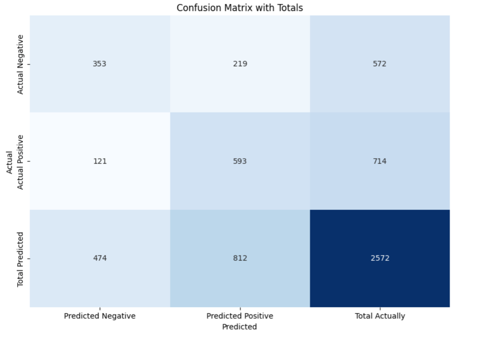

# Booster Uptake Prediction

**Should I take the booster? Why do some people hesitate?**

Vaccine hesitancy remains a critical challenge in public health, especially when it comes to booster shots. Understanding the behavioral and demographic factors behind this hesitation can help drive more effective interventions.

This project analyzes Canada’s 2022 COVID-19 Behavior Data, which encompasses key behaviors such as symptoms, testing, isolation, social distancing, and vaccination. By systematically preparing the data, conducting exploratory analysis, and training a K-Nearest Neighbors (K-NN) classification model, I predict the likelihood of individuals receiving a COVID-19 booster. The insights from this study can guide policymakers and healthcare organizations in developing strategies to enhance booster adoption and improve public health outcomes.

## Step 1: Data Preprocessing

Canada’s 2022 COVID-19 behavior dataset originally contained 6,430 rows and **512 columns**, with each row representing an individual. After a thorough examination, irrelevant and redundant columns were carefully removed, reducing the dataset to 61 relevant features. To standardize survey responses, categorical values were mapped to integers (e.g., "1-Agree" $\rightarrow$ 1), and missing values were imputed using mode imputation.

Following data preparation, **the dataset now consists of 61 integer-based features (binary or ranked values) with no missing values**. This clean, structured dataset is ready for in-depth exploration to identify key predictors of COVID-19 booster uptake.

## Step 2: Exploratory Data Analysis

The target variable is a binary categorical feature indicating whether an individual received a COVID-19 booster. Among the 6,430 records, approximately 57% represent individuals who received the booster, while 43% did not.

This analysis seeks to identify key factors influencing individuals' decisions about booster uptake. To structure the investigation, predictors have been categorized into seven key groups.

### **2.1 Personal Information:**

We examined various personal information, such as weight, age, employment status, region, and more. However, the most interesting and useful patterns emerged primarily from the variables related to **age and household size**.

- As age increases, the percentage of people who took booster shots also rises.
- Larger households tend to have a lower percentage of individuals receiving the booster shot.

### **2.2 Views towards Government Measures:**

Another factor we were interested in exploring is whether individuals believe that the government’s measures for handling COVID-19 were effective, which is represented by the variable *WCREX_1* in the dataset.

- There is a lower percentage of people receiving booster shots among those who do not trust the government’s COVID-19 protocols.

### 2.3 Emotion Factors:

We were also interested in examining whether an individual's level of happiness with their current life status might have influenced their decision to receive a booster shot. In the dataset, The variable called *cantril_ladder* was used, which ranges from 0 (feeling very bad) to 10 (feeling very good). 

- As the level of happiness increases, the rate of booster uptake also rises. 

### **2.4 Views Towards Coronavirus:**

There are several important variables in the dataset related to individuals' beliefs about COVID-19 (scaling from 1(Disagree) - 7 (Agree)).

- *r1_1*: "Coronavirus is very dangerous for me."
- *r1_2*: "It is likely that I will get coronavirus in the future."
- *r1_3*: "Getting a vaccine will protect me against coronavirus."
- *r1_9*: "Getting a vaccine will protect others against coronavirus."

After visualizing the data through graphs, we identified the following trends:

- Individuals who perceive COVID-19 as very dangerous are more likely to receive a booster shot.
- The belief that one is likely to contract COVID-19 in the future has little to no influence on the decision to get a booster.
- People who strongly believe that the vaccine protects them are significantly more likely to get a booster shot.
- The belief that the vaccine protects others also has a strong positive impact on booster uptake.

### **2.5 Preventing Actions Against COVID-19:**

We hypothesize that an individual's preventive behaviors against COVID-19 may offer valuable insights into their likelihood of receiving a booster dose.

- **Isolation Status** This variable measures an individual’s willingness to self-isolate when feeling unwell. Among those willing to self-isolate, over 60% received a third COVID-19 vaccine dose, whereas only 46% of those unwilling to self-isolate did. This suggests that individuals who prioritize self-isolation may be more inclined to receive a booster.
- **dangerous contact:** This variable captures whether individuals actively avoided high-risk places. Among those who did, 58% received a booster, compared to only 32% of those who did not, indicating a potential link between cautious behavior and booster uptake.

### **2.6 Social Distancing:**

We hypothesize that individuals who practice social distancing may be more risk-averse and proactive in protecting themselves, making them more likely to receive a booster.

- **soc1_1 & soc1_2:** These variables measure participation in social gatherings of more than six people, both outdoors and indoors. Individuals who avoid large gatherings—regardless of the setting—demonstrate a higher likelihood (approximately 60%) of receiving a booster.
- **Vent_3:** This variable assesses how frequently individuals avoided social gatherings over the past seven days, using a scale from 1 (Always) to 5 (Not at all). Those who consistently avoided social gatherings exhibited a higher likelihood of receiving a booster.

### **2.7 Views Towards Vaccines:**

- **Concerns about potential side effects:** individuals with fewer concerns about side effects are more likely to receive a third dose. 
- **Trust in vaccines:** individuals with high trust in vaccines are significantly more likely to take boosters, with around 80% of those expressing strong trust opting for a booster. 
- **Frontline emergency workers:** Individuals who believe that frontline emergency workers should be vaccinated are more likely to receive a booster, with around 70% opting for it.

In summary, our analysis focused on identifying factors that influence the decision to receive a COVID-19 booster. After a comprehensive examination of relationships and correlations between various predictors and the target variable, we selected **16 key predictors** to build our predictive model in the next step.

## Step 3: K-NN Model Tuning

The **K-Nearest Neighbors (K-NN)** algorithm is used to classify whether an individual has received a COVID-19 booster. This method identifies “similar” records in the training data and determines the classification of a new record based on a majority vote from its nearest neighbors.

- All categorical variables were properly converted into dummy variables.
- Since distance-based algorithms like K-NN are sensitive to feature magnitudes, feature scaling was applied before fitting the model.
- The dataset was partitioned into 80% training data and 20% validation data.
- **10-fold cross-validation** was used to tune the hyperparameter **K** for optimal accuracy. The highest accuracy achieved was 74.34% with an optimal K value of 22.

## Step 4: Predictive Performance

We trained the model using the entire training dataset with the optimal **K = 22** and evaluated its performance on the test set by comparing predictions with actual values. 

- **Accuracy (74%)**: The proportion of correctly predicted observations out of the total observations.
- **Sensitivity (84%)**: The model's ability to correctly identify individuals who received the booster.
- **Specificity (62%)**: The model's ability to correctly identify individuals who did not receive the booster.

The model demonstrates **high sensitivity**, meaning it effectively identifies those who received the booster, which is crucial for tracking vaccination uptake. However, its **lower specificity** indicates difficulty in correctly identifying those who did not receive the booster, potentially leading to overestimations of vaccination coverage.

False positives and false negatives highlight key misclassification challenges. In a public health context, false negatives—failing to identify individuals who have not received a booster—are particularly concerning, as they may result in missed opportunities for targeted vaccination efforts.

To improve performance, incorporating additional predictors or exploring alternative classification models, such as logistic regression or ensemble methods, could enhance overall accuracy and better balance sensitivity and specificity.
